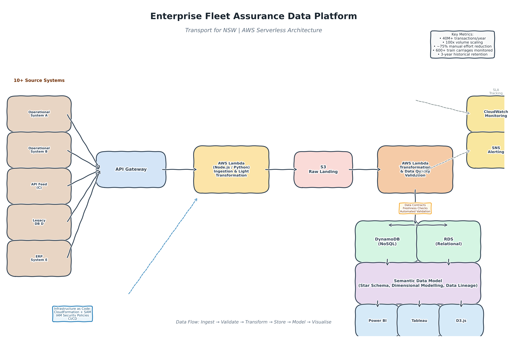

# Daniel Xu — Data Engineering Portfolio

> **Senior Data Engineer | AWS Data Pipelines, ELT & Analytics**  
> Sydney, NSW | daniellfxu@gmail.com | [LinkedIn](https://linkedin.com/in/danielxu) *(update link)*

---

## About

I am a Senior Data Engineer with 8+ years designing and operating production **ETL/ELT data pipelines** on AWS, building **cloud-native data architectures** that process 40M+ transactions annually, and delivering **governed, AI-ready datasets** with automated quality validation and clear lineage.

My work sits at the intersection of **data engineering, cloud infrastructure, and business intelligence**. I have led end-to-end platform delivery across transport, telecommunications, and insurance — from ingestion and transformation to executive dashboards and regulatory reporting.

**What I bring:**
- Pipeline ownership: event-driven ELT, API ingestion, incremental loads, data contracts
- Cloud architecture: AWS serverless (Lambda, S3, DynamoDB, RDS, API Gateway, CloudFormation/SAM)
- Data modelling: semantic models, dimensional modelling (star schema), data lineage
- Data quality: automated validation, freshness monitoring, SLA alerting
- Outcomes: 40M+ records/year, 100x volume scaling, ~75% manual reporting reduction

---

## Tech Stack

| Category | Tools |
|:---|:---|
| **Languages** | Python, SQL, NumPy |
| **Cloud Data Platforms** | AWS (S3, Lambda, API Gateway, Glue, RDS, DynamoDB, CloudFront, Route 53, CloudWatch, SNS) |
| **Data Integration & Pipelines** | ETL, ELT, API ingestion, JSON/XML exchange, event-driven architecture, incremental loads, data validation, data contracts |
| **Data Modelling & Warehousing** | Semantic modelling, dimensional modelling, star schema, relational modelling, data architecture, data lineage |
| **Data Quality & Governance** | Automated validation, freshness checks, KPI automation, data contracts, data cataloguing |
| **Orchestration & IaC** | CloudFormation, SAM, Git, CI/CD |
| **BI & Visualisation** | Power BI, Tableau, D3.js |

---

## Case Studies

### 1. Enterprise Fleet Assurance Data Platform
**Transport for NSW | Solution Architect / Lead Data Engineer | Aug 2019 – Mar 2026**

> An enterprise data and reporting platform supporting fleet performance monitoring, investigation, and regulatory reporting across 600+ train carriages.

#### Overview
Built a fully serverless data platform on AWS to consolidate operational data from 10+ disparate source systems, automate contractual KPI reporting, and enable 3-year historical trend analysis for a $40M/year government contract.

#### Architecture
```
10+ Source Systems (APIs, operational DBs)
    ↓
API Gateway + AWS Lambda (Node.js / Python)  —  ingestion & light transformation
    ↓
S3 (raw landing) → Lambda → DynamoDB + RDS (structured storage)
    ↓
Semantic Data Model (star schema) → Power BI / Tableau / D3.js dashboards
    ↓
CloudWatch + SNS  —  monitoring, alerting, SLA tracking
```


#### Key Results
- **40M+ contract transactions/year** ingested and processed reliably
- **100x volume increase absorbed** through re-architecture of caching, Lambda concurrency, and DynamoDB partition strategy — zero service disruption
- **~75% reduction in manual reporting effort** via automated data validation, KPI computation, and scheduled report generation
- **20+ interactive dashboards** delivered for operational and executive stakeholders
- **AWS Well-Architected Review completed** with AWS Principal Solutions Architect — validated against all six pillars

#### What I Designed
- ELT pipeline orchestration: API ingestion → S3 landing → transformation → dual storage layer (DynamoDB + RDS)
- Data contracts and automated validation rules embedded in the pipeline
- Semantic data model translating contractual/regulatory definitions into automated KPIs
- Infrastructure-as-code (CloudFormation/SAM) with IAM security policies and audit logging
- C4 model documentation for cross-team architecture alignment

---

### 2. Metro Fleet Maintenance Data Model
**Sydney Trains (Transport for NSW) | Senior Data Analyst / Backend Developer | Apr 2018 – May 2019**

> A relational data-modelling and forecasting engine supporting 10-year budget planning and $30M investment decisions.

#### Overview
Designed and built a serverless AWS application that modelled 44 million budget scenarios to support executive decision-making for large-scale fleet maintenance investments.

#### Architecture
```
Operational source data
    ↓
Python/NumPy backend  —  scenario simulation & algorithm-heavy transformations
    ↓
Relational data model  —  structured storage for 44M scenarios
    ↓
Tableau / Power BI / D3.js  —  executive scenario exploration dashboards
```

#### Key Results
- **44 million scenarios modelled** for 10-year budget forecasting
- **$30M investment evaluation supported** with robust data modelling and scenario analysis
- **Interactive dashboards** enabling stakeholders to explore trade-offs in real time

#### What I Built
- Relational database schema and ETL processes for high-volume scenario data
- Python/NumPy algorithms for simulation and forecasting
- Executive-facing BI layer for self-service exploration

---

### 3. National Broadband Activation Operations Transformation
**NBN Co. | Manager, Data & Continuous Improvement | Apr 2015 – May 2017**

> Consolidated operational data across six systems and built analytical pipelines to optimise a 100+ FTE national activation division.

#### Overview
Led a team of four analysts/developers delivering 25+ improvement and automation projects. Built unified data pipelines to replace fragmented, manual reporting across six operational systems.

#### Architecture
```
6 Operational Systems
    ↓
Python/NumPy ETL pipelines  —  daily consolidation & transformation
    ↓
Unified datasets  —  Tableau / Power BI reporting
    ↓
Executive & operational dashboards
```

#### Key Results
- **Daily transaction data consolidated** from six systems into unified analytical datasets
- **20+ FTE roles saved** via a Python decision-tree optimisation model for call centre operations
- **25+ projects delivered** across three divisions, including a 100+ FTE activation division

#### What I Led
- ETL pipeline design and implementation (Python, NumPy)
- Data consolidation strategy for multi-source operational environments
- Analytical models supporting process optimisation and workforce planning
- Team leadership and cross-functional stakeholder engagement

---

### 4. Call Centre Transformation — Data Pipelines for A/B Testing
**IAG Insurance | Senior Business Analyst | Jun 2014 – Jun 2015**

> Built data pipelines and statistical models to test operational restructure strategies across a 500+ seat call centre.

#### Overview
Developed Python-based data pipelines for simulation, A/B testing, and statistical analysis to inform a major call centre transformation and improve customer experience metrics.

#### Key Results
- **500+ seat call centre transformation** supported with data models
- **NPS and cycle-time improvements** informed by simulation and designed experiments (DOE)
- **Statistical and machine learning methods** prototyped in Python (NumPy) for strategy validation

---

## Certifications

- AWS Certified Cloud Practitioner — Amazon Web Services
- Certified Solutions Developer — Microsoft
- Certified Professional Engineer — Engineers Australia
- Certified Lean Six Sigma Black Belt — American Society for Quality (ASQ)

---

## Professional Development

I am actively closing gaps with modern data engineering tooling:

- **dbt Fundamentals** (dbt Labs) — In Progress: modular SQL transformations, testing, and documentation
- **Apache Airflow** — Self-directed: migrating Python ETL scripts into orchestrated DAGs with scheduling and monitoring
- **Snowflake Data Warehouse** — Self-directed: building star schema models and BI integrations

---

## How to Navigate This Portfolio

| If you are... | Start here |
|:---|:---|
| A **hiring manager** looking for outcomes | Case Study 1 (Fleet Assurance) — scroll to *Key Results* |
| A **technical lead** evaluating architecture | Case Study 1 — *Architecture* and *What I Designed* sections |
| A **recruiter** scanning for keywords | *Tech Stack* table and *Certifications* |
| Interested in **data quality & governance** | Case Study 1 — *What I Designed* (data contracts, validation) |
| Interested in **scale & reliability** | Case Study 1 — *100x volume increase* and *Well-Architected Review* |

---

## Contact

- **Email:** daniellfxu@gmail.com
- **Location:** Sydney, NSW
- **LinkedIn:** *(to update)*

> **Referees available upon request.**

---

*Note: Enterprise projects (Transport for NSW, Sydney Trains, NBN Co., IAG) were built in secure internal environments. Code and raw data are proprietary and cannot be shared publicly. Architecture diagrams, methodology descriptions, and outcome metrics are provided here for portfolio purposes.*
